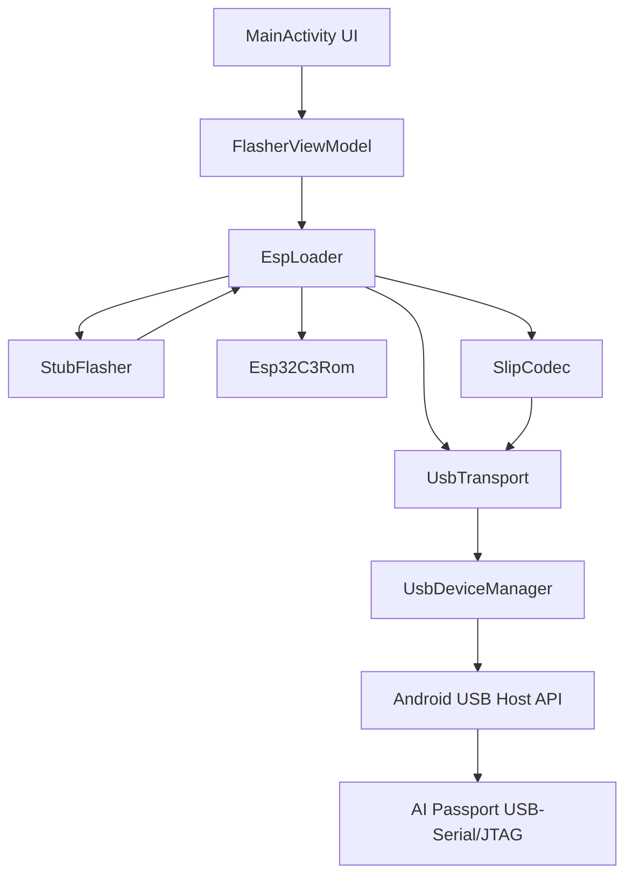

# Passport 安卓固件刷写器 - 技术设计文档

Feature Name: passport-android-flasher
Updated: 2026-08-24

## Description

为 FoloToy AI Passport（ESP32-C3）开发原生安卓（Kotlin）固件刷写应用。手机通过 USB OTG 以 Host 方式连接设备的原生 USB-Serial/JTAG 端口，移植乐鑫 esptool 协议（源自 esptool-js 0.6.1，Apache-2.0）完成连接、芯片识别、固件写入、MD5 校验与全片擦除。所有固件数据仅在手机本地处理。

### 技术事实来源

- esptool-js 0.6.1 源码（npm 包，Apache-2.0）：`/tmp/opencode/package/lib/`
- ESP32-C3 USB-Serial/JTAG：VID 0x303A，PID 0x1001，vendor-specific 接口，2 个 bulk 端点（串口 TX/RX）+ 1 个 bulk IN（JTAG）
- ESP32-C3 ROM 下载协议 magic：`0x6921506f / 0x1b31506f / 0x4881606f / 0x4361606f`

## Architecture



### 架构说明

- **UI 层**：单 Activity（传统 View + Kotlin），状态由 ViewModel 持有，通过单向数据流更新。
- **协议层**：`EspLoader` 移植 esptool-js 的 `ESPLoader`（lib/esploader.js），包含命令封装、连接流程、stub 加载、写入/擦除/校验。
- **传输层**：`UsbTransport` 实现 esptool-js `Transport` 接口语义（write/read/flushInput/setDTR/setRTS），底层使用 Android `UsbDeviceConnection` 的 bulk 传输与控制传输。
- **线协议**：`SlipCodec` 实现 SLIP 帧编解码（lib/webserial.js#L110-L339）。

## Components and Interfaces

### com.passport.flasher.usb.UsbDeviceManager

发现并打开设备，申请 USB 权限。

```kotlin
class UsbDeviceManager(context, usbManager): AutoCloseable {
    fun findPassport(): UsbDevice?          // VID=0x303A, PID=0x1001
    fun requestPermission(device): Boolean  // 触发系统授权对话框
    fun open(device): UsbDeviceConnection?  // claimInterface + 打开连接
    fun isOtgSupported(): Boolean           // PackageManager.FEATURE_USB_HOST
    fun close()
}
```

### com.passport.flasher.usb.UsbTransport

字节传输层，语义对齐 esptool-js `Transport`。

```kotlin
class UsbTransport(connection, device): Transport {
    fun write(data: ByteArray)                  // SLIP 编码后 bulk 写
    fun read(timeoutMs: Long): ByteArray        // SLIP 解码读一帧
    fun readRaw(timeoutMs: Long): ByteArray?    // 原始读（stub OHAI、日志流）
    fun flushInput()
    fun setDTR(state: Boolean)                  // 控制请求 0x22, bit0
    fun setRTS(state: Boolean)                  // 控制请求 0x22, bit1
    fun setBaudrate(hz: Int)                    // SET_LINE_CODING 0x20
}
```

### com.passport.flasher.esptool.SlipCodec

SLIP 编解码，常量与实现参照 lib/webserial.js#L22-L27。

```kotlin
object SlipCodec {
    const val END = 0xc0; const val ESC = 0xdb
    const val ESC_END = 0xdc; const val ESC_ESC = 0xdd
    fun encode(payload: ByteArray): ByteArray
    fun decode(stream: ByteArray, partial: FrameAccumulator): ByteArray?
}
```

### com.passport.flasher.esptool.Esp32C3Rom

ESP32-C3 芯片参数（对照 lib/targets/esp32c3.js）：

- `IMAGE_CHIP_ID = 5`
- `FLASH_WRITE_SIZE = 0x400`（ROM 模式块大小）
- `EFUSE_BASE = 0x60008800`，`MAC_EFUSE_REG = EFUSE_BASE + 0x044`
- `getEraseSize(offset, size) = size`（无需对齐擦除）
- Flash 容量/厂商从 eFuse 位段解析

### com.passport.flasher.esptool.EspLoader

协议核心，移植 lib/esploader.js。

```kotlin
class EspLoader(transport, baudrate, terminal) {
    suspend fun connect(mode: String, attempts: Int)   // 复位序列 + sync + 芯片识别
    suspend fun runStub(): Boolean                     // 上传并启动 stub loader
    suspend fun writeFlash(options: FlashOptions)      // 写入全部分区 + MD5 校验
    suspend fun eraseFlash()                           // 全片擦除
    suspend fun changeBaud()                           // 切换波特率
    suspend fun after(mode: String)                    // 重启/复位
}
```

### com.passport.flasher.esptool.StubData

stub loader 二进制数据（取自 stub_flasher_32c3.json）：

- `entry = 0x40370010`，`text_start = 0x40370000`
- `text = base64(5160 B)`，`data_start = 0x3FC91034`，`data = base64(216 B)`，`bss_start = 0x3FC8A000`

### com.passport.flasher.esptool.FirmwareImage

固件解析与地址分配：

- 单个合并固件：地址 0x0
- 多分区：按文件名默认地址（bootloader.bin→0x0, partition-table.bin→0x8000, app 及 user 文件→用户指定，默认 0x10000 递增），用户可编辑
- 起始偏移按 4 字节对齐，不足用 0xFF 填充

## Data Models

### FlashOptions

```kotlin
data class FlashOptions(
    val files: List<FirmwareFile>,   // data + address
    val compress: Boolean = true,    // deflate level 9
    val flashMode: String = "keep",
    val flashFreq: String = "keep",
    val flashSize: String = "keep",  // 本设备固定 8MB
    val eraseAll: Boolean = false,
    val calculateMD5Hash: Boolean = true,
)
```

### FirmwareFile

```kotlin
data class FirmwareFile(
    val name: String,
    val data: ByteArray,     // 固件内容
    var address: Long,       // 写入起始地址
)
```

### 连接状态机


## Correctness Properties

1. 单事务互斥：同一时间只允许一个刷写/擦除任务运行，操作前锁定、结束后解锁。
2. SLIP 完整性：发送帧以 0xC0 起止，内部 0xC0/0xDB 必须转义；读取帧在收到结束符前持续累积。
3. 校验一致性：每分区写入后，将设备端 `flashMd5sum` 与本地计算的 MD5 比对，不一致即失败。
4. 波特率同步：`CHANGE_BAUDRATE` 命令发出后，host 侧必须通过 `SET_LINE_CODING` 同步切换，否则按 115200 回退。
5. 资源释放：任何路径退出时 `close()` USB 连接并 `releaseInterface`。
6. 线程约束：USB 读写与 UI 更新分离；所有 USB 调用发生在单工作线程，UI 状态通过 ViewModel 主线程回调。

## Error Handling

| 场景 | 处理 |
| --- | --- |
| 无 USB Host 功能 | 提示"此设备不支持 USB Host"，禁用连接 |
| 未找到 AI Passport | 提示插入设备并授予权限 |
| USB 权限被拒 | 停留未连接状态，提示需要权限 |
| sync 握手失败 | 重试 5 次，报告"连接失败，请确认设备处于下载模式" |
| stub 启动无 OHAI | 报告"stub 启动失败"，建议重试 |
| 分区写入失败 | 重试 3 次，仍失败则中止并显示地址与原因 |
| MD5 不一致 | 报告校验失败，提示重新刷写 |
| 刷写中设备拔出 | 取消操作，释放资源，提示连接丢失 |

## Test Strategy

- **主机侧逻辑测试（JVM 单元测试）**：
  - SlipCodec 编码/解码往返测试（含转义边界）
  - 命令包构造字节序与 checksum（XOR, 初值 0xEF）测试
  - 固件地址推断与 4 字节填充测试
  - MD5 计算正确性（与设备端格式一致）
- **仪器化测试（需真机）**：
  - 连接-识别-断开往返
  - 空固件与 8MB 合并固件写入
  - 擦除-重写全流程
  - 低波特率与高波特率写入对比
- **验收对照**：与官方 web flasher 在同一台设备上执行相同固件写入，比对结果。

## References

[^1]: esptool-js 0.6.1（Apache-2.0）- [esploader.js](/tmp/opencode/package/lib/esploader.js)
[^2]: esptool-js Transport/SLIP - [webserial.js](/tmp/opencode/package/lib/webserial.js#L22-L339)
[^3]: esptool-js USB JTAG 复位序列 - [reset.js](/tmp/opencode/package/lib/reset.js#L57-L87)
[^4]: ESP32-C3 ROM 定义 - [esp32c3.js](/tmp/opencode/package/lib/targets/esp32c3.js)
[^5]: stub loader 数据 - [stub_flasher_32c3.json](/tmp/opencode/package/lib/targets/stub_flasher/stub_flasher_32c3.json)
[^6]: 官方网页刷写工具（Web Serial + esptool-js）- [web-flasher](https://ai-passport.folotoy.cn/tools/web-flasher/)
